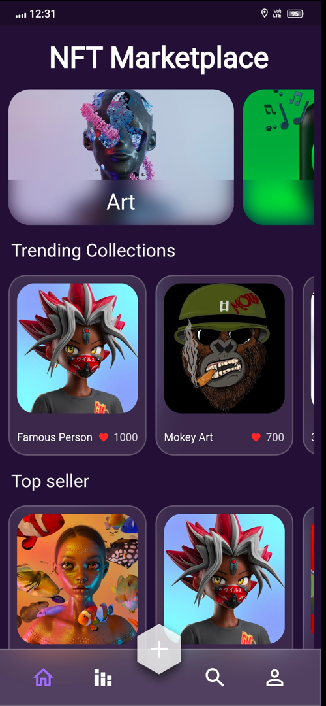
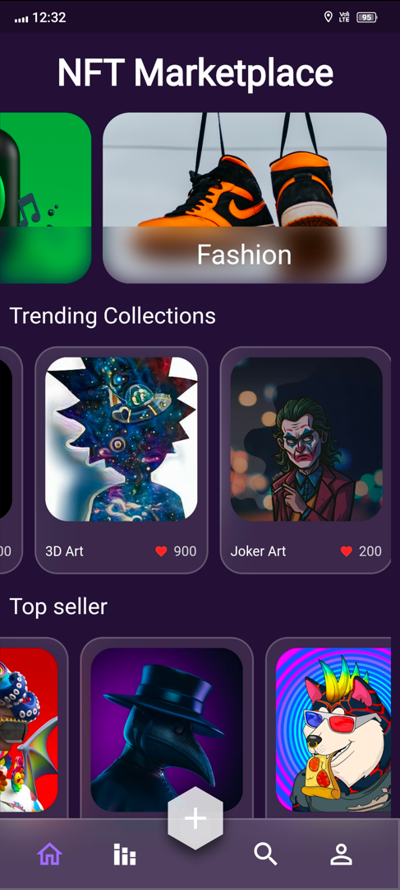
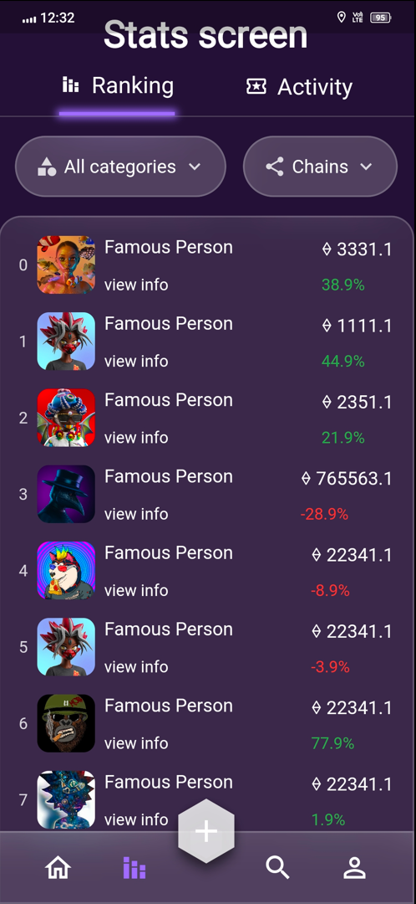

# NFT Flutter Application
## App Screenshots


   <br>
  

## Table of Contents

- [Introduction](#introduction)
- [Features](#features)
- [Getting Started](#getting-started)
  - [Prerequisites](#prerequisites)
  - [Installation](#installation)
- [Usage](#usage)
- [Contributing](#contributing)
- [License](#license)

## Introduction

This Flutter application is designed to showcase and interact with Non-Fungible Tokens (NFTs). NFTs are unique digital assets that represent ownership of digital or physical items, art, collectibles, and more. This app allows users to browse, buy, and manage their NFT collections.

## Features

- Browse NFT Marketplaces
- Purchase NFTs
- View and manage your NFT collection
- Explore NFT details and metadata
- Secure wallet integration
- Real-time NFT tracking

## Getting Started

### Prerequisites

Before you begin, ensure you have met the following requirements:

- [Flutter](https://flutter.dev/) installed on your local development environment.
- [Dart](https://dart.dev/) programming language installed.

### Installation

1. Clone the repository:

   ```shell
   git clone https://github.com/yourusername/nft-flutter-app.git

## Usage
Launch the app on your device.
Explore the NFT marketplaces available within the app.
Browse and purchase NFTs using your wallet.
Manage your NFT collection.
View NFT details and metadata.
Enjoy your NFT experience!

## Contributing
Contributions are welcome! If you'd like to contribute to this project, please follow these steps:

Fork the repository.
Create a new branch for your feature or bug fix: git checkout -b feature/your-feature-name.
Make your changes and commit them: git commit -m 'Add some feature'.
Push to your forked repository: git push origin feature/your-feature-name.
Create a pull request to the main branch of the original repository.
Please follow the Code of Conduct and Contribution Guidelines when contributing to this project.

## License
This project is licensed under the MIT License - see the LICENSE file for details.

Make sure to replace placeholders like `lachu21` with your actual information and customize the sections as needed to provide comprehensive information about your NFT Flutter application. Include screenshots or other visual elements to make your README more engaging and informative for users and contributors.
